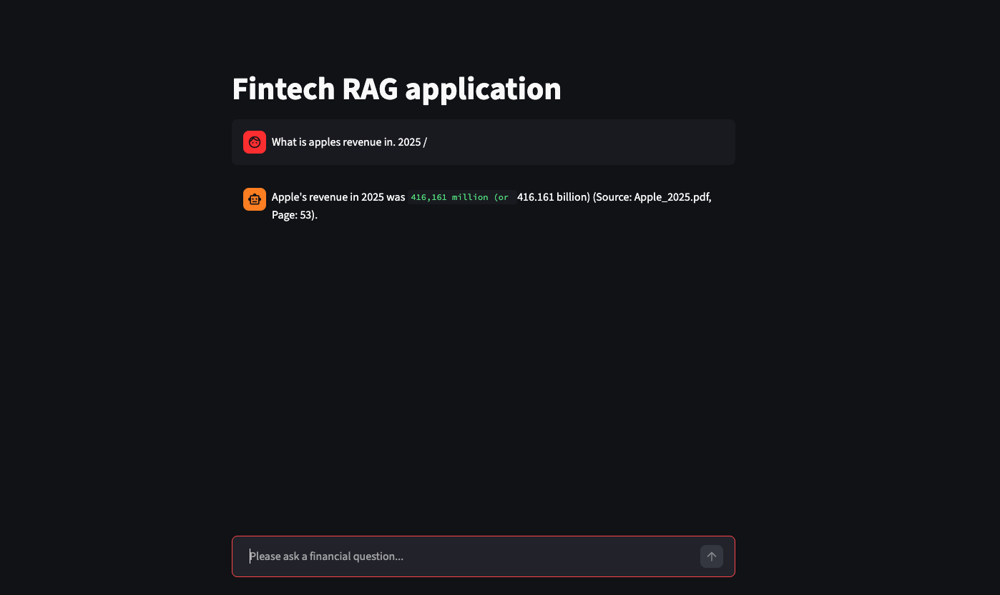
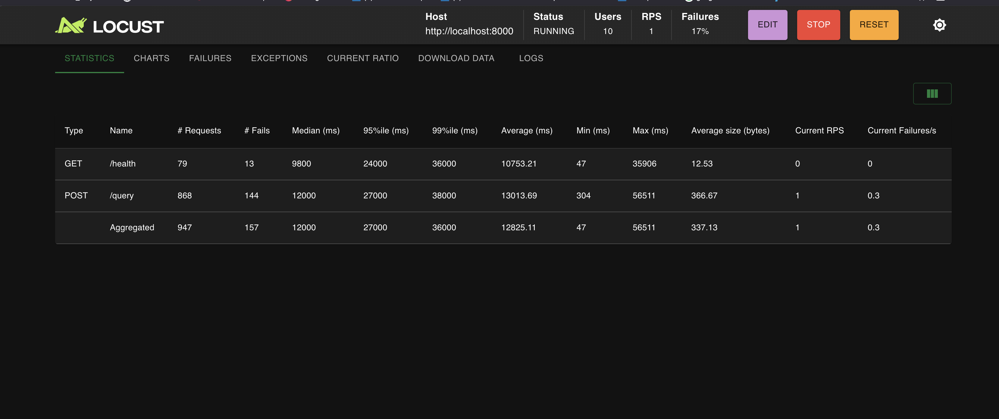
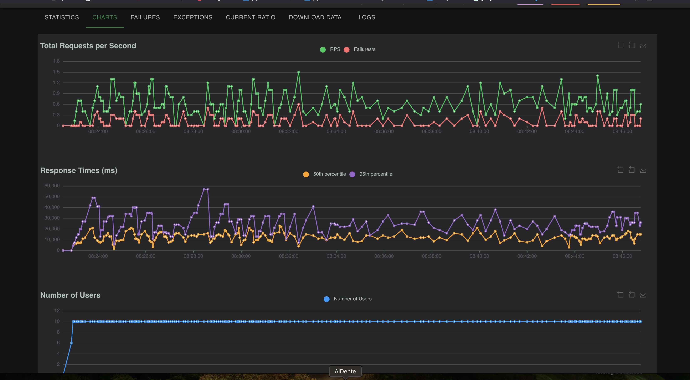
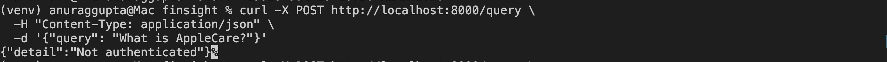
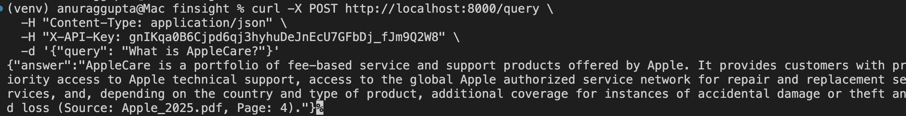
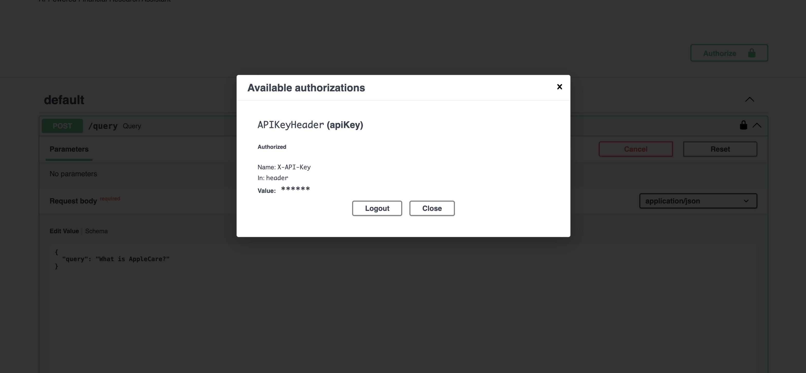
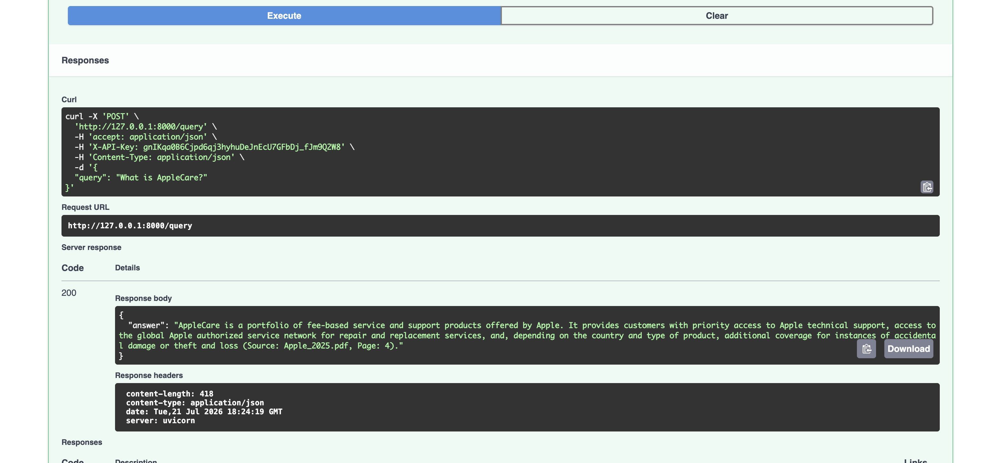
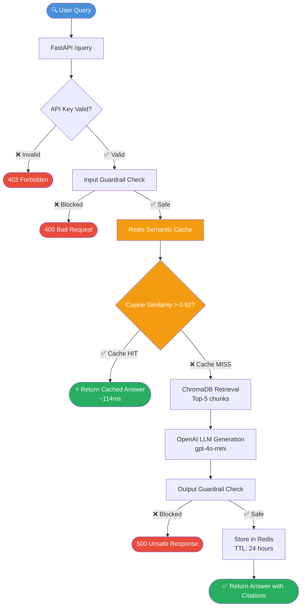
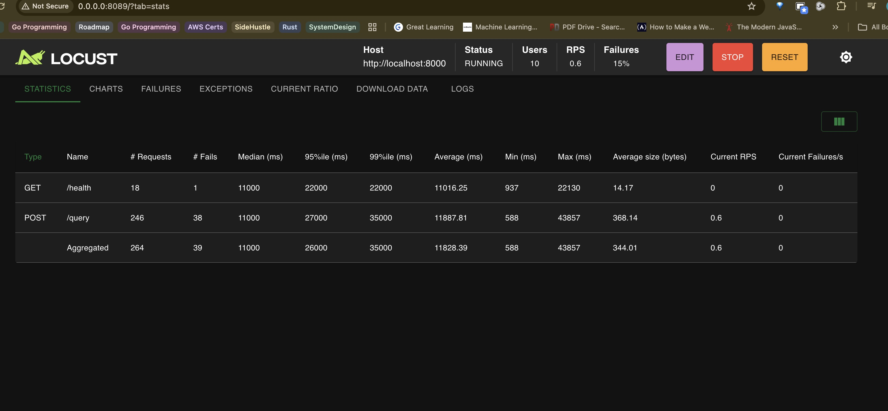
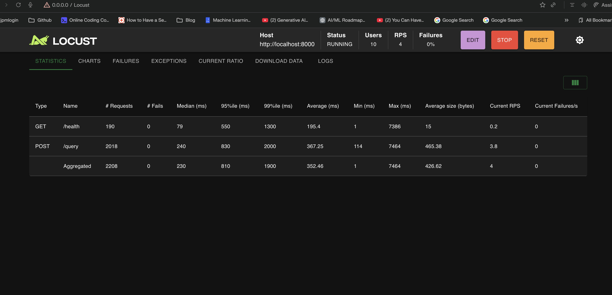

# FinSight — AI-Powered Financial Research Assistant

An end-to-end RAG (Retrieval-Augmented Generation) system that enables business professionals to query SEC 10-K financial filings using natural language. Instead of manually reading 200-page annual reports, users ask questions and receive accurate, cited answers in seconds.



## What It Does

Ask natural language questions across SEC financial filings:

| Query | Response |
|-------|----------|
| "What was Apple's total revenue in 2025?" | "Apple's total net sales (revenue) for the year 2025 amounted to **$416,161 million** (or $416.161 billion). (Source: Apple_2025.pdf, Page: 53)" |
| "How much did Apple spend on R&D?" | "In 2025, Apple spent **$34,550 million** on R&D, an increase from $31,370 million in 2024. (Source: Apple_2025.pdf, Page: 32)" |
| "What is the capital of France?" | "Information not found in financial records." |

The system retrieves relevant document sections, generates cited answers, and correctly refuses to answer questions not covered by the source documents.

---

## Recent Improvements

### Conversational Query Reformation
FinSight now maintains conversational context across multi-turn queries. 
Ambiguous follow-up questions like "What was it in 2024?" are automatically 
rewritten into explicit standalone queries ("What was Apple's total net sales 
revenue in 2024?") before hitting the retriever — eliminating pronoun 
resolution failures and year substitution hallucinations.

### Streaming Responses
LLM responses now stream token-by-token to the UI, matching the UX of 
modern AI assistants. Eliminates the 3-4 second wait for full response 
generation.


## Architecture

```
                         FinSight RAG Pipeline
                         
    ┌──────────────────── INGESTION ────────────────────┐
    │                                                    │
    │  📄 PDF Upload → 📝 Text Extraction → ✂️ Chunking  │
    │  (pdfplumber)    (clean text)     (1000 chars,    │
    │                                    200 overlap)    │
    │                        ↓                           │
    │              🔢 Embedding (OpenAI)                  │
    │                        ↓                           │
    │              💾 ChromaDB Storage                    │
    └────────────────────────────────────────────────────┘
                             ↓
    ┌──────────────────── RETRIEVAL ─────────────────────┐
    │                                                    │
    │  🔍 User Query → Semantic Search → Top-K Chunks    │
    │                  (with metadata     (k=5)          │
    │                   filtering)                       │
    └────────────────────────────────────────────────────┘
                             ↓
    ┌──────────────────── GENERATION ────────────────────┐
    │                                                    │
    │  📋 System Prompt + Context + Query → 🤖 GPT-4o-mini│
    │  (financial analyst   (XML tags)     (temp=0.1)    │
    │   role + guardrails)       ↓                       │
    │                      💬 Cited Response              │
    └────────────────────────────────────────────────────┘
```

---

## Tech Stack

| Component | Technology | Why This Choice |
|-----------|-----------|----------------|
| **Language** | Python 3.11+ | Industry standard for AI/ML |
| **LLM** | GPT-4o-mini | 15x cheaper than GPT-4o, sufficient quality for extraction/summarisation |
| **Embeddings** | text-embedding-3-small | Cost-effective, good quality for financial document search |
| **Vector DB** | ChromaDB | Embedded, zero infrastructure, ideal for portfolio-scale projects |
| **Framework** | LangChain | Consistent Document abstraction across the full pipeline |
| **PDF Processing** | pdfplumber | Superior text extraction vs PyPDFLoader for SEC filing PDFs |
| **Backend API** | FastAPI | High-performance async Python API framework |
| **Frontend** | Streamlit | Rapid UI prototyping with built-in chat components |
| **Evaluation** | Custom + Ragas | Automated evaluation with key-fact matching |

---

## Project Structure

```
finsight/
├── README.md
├── requirements.txt
├── .env.example
├── src/
│   ├── config.py                    # Centralised configuration
│   ├── ingestion/
│   │   ├── loader.py                # PDF loading with pdfplumber
│   │   ├── chunker.py               # Recursive character splitting
│   │   └── embedder.py              # OpenAI embedding + ChromaDB storage
│   ├── retrieval/
│   │   ├── vector_store.py          # ChromaDB connection (singleton)
│   │   ├── retriever.py             # Semantic search with filtering
│   │   └── reranker.py              # Cross-encoder reranking (planned)
│   ├── generation/
│   │   ├── prompt_templates.py      # System prompt + context formatting
│   │   └── generator.py             # LLM response generation
│   ├── evaluation/
│   │   ├── eval_dataset.py          # Test question loader
│   │   ├── test_questions.json      # 12 Q&A test pairs
│   │   └── run_eval.py              # Automated evaluation runner
│   ├── api/
│   │   ├── main.py                  # FastAPI application
│   │   ├── routes.py                # API endpoints
│   │   └── models.py                # Pydantic schemas
│   └── security/
│   |   ├── input_guard.py           # Prompt injection prevention
│   |   └── output_guard.py          # Response safety checks
├── |
│   ├── cache/
│   │   ├── __init__.py
│   │   └── semantic_cache.py       # Redis semantic caching
├── ui/
│   └── app.py                       # Streamlit chat interface
├── data/
│   ├── raw/                         # Source SEC filings (PDFs)
│   └── processed/                   # Processed documents
├── evaluation_results/              # Evaluation reports
├── docs/
│   ├── ARCHITECTURE.md              # Architecture Decision Records
│   └── screenshot/                 # UI screenshots
└── tests/                           # Unit tests
```

---

## Quick Start

### Prerequisites
- Python 3.11+
- OpenAI API key

### Setup

```bash
# Clone the repository
git clone https://github.com/anurag1210/finsight.git
cd finsight

# Create virtual environment
python -m venv .venv
source .venv/bin/activate

# Install dependencies
pip install -r requirements.txt

# Configure environment
cp .env.example .env
# Edit .env and add your OpenAI API key
```

### Load Documents

Place SEC 10-K filing PDFs in `data/raw/`, then run the ingestion pipeline:

```bash
python -m src.ingestion.embedder
```

This loads PDFs, chunks them, generates embeddings, and stores everything in ChromaDB.

### Run the Application

```bash
PYTHONPATH=. streamlit run ui/app.py
```

Open `http://localhost:8501` in your browser and start asking financial questions.

---

## Evaluation Results

Automated evaluation across 12 test questions (mix of easy, medium, hard, and unanswerable):

| Difficulty | Accuracy | Questions |
|-----------|----------|-----------|
| Easy | 28.57%* | 2 |
| Medium | 51.39% | 3 |
| Hard | 40.00% | 1 |
| Unanswerable | **100.00%** | 3 |
| **Overall** | **61.26%** | **9** |

**Average Latency:** 2.95 seconds per query

*\*Note: Easy question scores are artificially low due to strict number-format matching in evaluation (e.g., "$91,281 million" vs "$91.281 billion" counted as mismatch). The generated answers are factually correct — the evaluation matching logic needs refinement. See [Improvements](#future-improvements) below.*

### Key Findings
- **Guardrails work perfectly**: 100% accuracy on unanswerable questions — the system correctly refuses to hallucinate
- **Retrieval is strong**: Semantic search consistently finds relevant financial data sections
- **Citation quality**: Every response includes source file and page number citations

---

## Architecture Decisions

### Why pdfplumber over PyPDFLoader?
**Problem discovered during development:** PyPDFLoader extracted SEC filing text with spaces between every character ("B u s i n e s s R i s k s"). This would corrupt embeddings and inflate token costs by 5-10x. pdfplumber correctly extracts clean, readable text from the same PDFs.

**Lesson:** Data quality matters more than model choice. Garbage embeddings from poorly extracted text will produce garbage retrieval regardless of how good the LLM is.

### Why ChromaDB over Pinecone or pgvector?
ChromaDB is embedded (runs in-process), requires zero infrastructure setup, and persists to disk. For a portfolio project with 3-5 documents, managed services like Pinecone add unnecessary complexity and cost. In production at scale, I would migrate to Pinecone or pgvector for managed scaling, replication, and monitoring.

### Why GPT-4o-mini over GPT-4o?
For financial document summarisation and extraction, GPT-4o-mini provides sufficient quality at 15x lower cost. The task doesn't require the deep multi-step reasoning that GPT-4o excels at. I would upgrade to GPT-4o only for complex analytical queries requiring cross-document reasoning.

### Why chunk_size=1000 with overlap=200?
- **Too small (200-500):** Fragments sentences and loses paragraph-level context
- **Too large (2000+):** Dilutes relevance — chunks cover too many topics
- **1000 characters:** Preserves 2-3 complete paragraphs, focused enough for targeted retrieval
- **200 overlap:** Prevents information loss at chunk boundaries

### Why temperature=0.1?
Financial answers must be factual and consistent. High temperature introduces variability — the same question might produce different revenue figures on different runs. Near-zero temperature ensures deterministic, reliable responses while allowing minimal variation for natural-sounding language.

---

## Future Improvements

With more time, I would add:

- **LLM-as-Judge Evaluation**: Replace keyword matching with GPT-based evaluation to handle number format variations and assess answer quality more accurately
- **Hybrid Search**: Combine BM25 keyword search with semantic search for better retrieval of financial terminology and specific figures
- **Cross-Encoder Reranking**: Add a reranking step after initial retrieval for more precise document selection
- **Multi-Document Comparison**: Enable queries like "Compare Apple's and Tesla's R&D spending"
- **Streaming Responses**: Stream LLM output token-by-token for better UX
- **Response Caching**: Cache frequently asked questions to reduce latency and API costs
- **Docker Deployment**: One-command setup with docker-compose
- **SEC EDGAR API Integration**: Fetch filings dynamically by company ticker instead of manual PDF download

---

## What I Learned

Building this project reinforced several key principles:

1. **Data quality > Model quality**: The pdfplumber discovery proved that clean input data matters more than a powerful LLM
2. **Evaluation is hard**: Designing fair evaluation metrics is as challenging as building the system itself
3. **Production thinking matters**: Guardrails, error handling, and "I don't know" responses are what separate demo projects from production systems
4. **Architecture decisions need justification**: Every choice (chunk size, model, vector DB) involves tradeoffs — documenting them shows engineering maturity

---

## Author

**Anurag Gupta** — Senior Software Engineer with 17 years of production engineering experience, transitioning into AI Engineering. Building in public to document the journey.

- GitHub: [github.com/anurag1210](https://github.com/anurag1210)
- Twitter/X: #BuildInPublic #AIEngineering

## Observability

FinSight integrates with [LangSmith](https://smith.langchain.com) for full 
observability of the RAG pipeline in production.

Every query is automatically traced with:
- **Latency** — end-to-end response time per query
- **Token usage** — input and output tokens consumed
- **Cost** — per-query OpenAI API cost
- **Input/Output** — exact context retrieved and response generated
- **Error tracking** — failed queries flagged for analysis

### Setup

Add the following to your `.env` file:

```env
LANGCHAIN_TRACING_V2=true
LANGCHAIN_ENDPOINT=https://api.smith.langchain.com
LANGCHAIN_API_KEY=your-langsmith-api-key
LANGCHAIN_PROJECT=finsight
```

No code changes required — LangChain automatically detects these variables 
and traces every LangChain component call to LangSmith.

### Dashboard


##########LOAD TESTING with LOCUST##############################


## ⚡ Load Testing with Locust

### Overview
FinSight was load tested using [Locust](https://locust.io/) to simulate concurrent users 
hitting the FastAPI backend and identify performance bottlenecks under real-world conditions.

### Setup
```bash
pip install locust
locust -f locust.py --host=http://localhost:8000
```

Open `http://localhost:8089` to access the Locust UI.

### Test Configuration
- **Concurrent users:** 10
- **Ramp up rate:** 2 users/second
- **Endpoints tested:** `POST /query`, `GET /health`

### Results

| Endpoint | Requests | Failures | Median (ms) | 95th %ile (ms) | Avg (ms) |
|----------|----------|----------|-------------|----------------|----------|
| GET /health | 24 | 0 | 6,500 | 14,000 | 8,433 |
| POST /query | 258 | 41 | 13,000 | 32,000 | 14,157 |

### Key Findings

**What worked well:**
- Zero 422 errors after fixing request schema alignment
- System handled concurrent requests correctly
- FastAPI layer itself is not the bottleneck — confirmed by /health vs /query latency gap

**Bottlenecks identified:**
- Response times degraded from ~7.5s median at low load to ~13s under sustained concurrency
- 17% connection timeouts at sustained 10-user load
- Root cause: OpenAI API rate limits and blocking LLM calls, not the FastAPI layer

**Connection errors observed:**


ConnectionResetError(54, 'Connection reset by peer')
These occur when OpenAI API calls exceed timeout thresholds under concurrent load.

### Production Improvements Identified

1. **Redis Semantic Caching** — Cache responses for semantically similar queries 
   (cosine similarity > 0.92 threshold) to eliminate redundant OpenAI API calls
   
2. **Async Task Queue** — Use Celery or Redis Queue to handle LLM calls 
   asynchronously, preventing connection timeouts under sustained load
   
3. **Horizontal Scaling** — Deploy multiple FastAPI instances behind a load 
   balancer (Kubernetes HPA) to distribute concurrent requests
   
4. **OpenAI Rate Limit Handling** — Implement exponential backoff and request 
   queuing to handle API rate limit responses gracefully

### Lesson Learned
The bottleneck in a RAG system under load is almost always the LLM API call, 
not the retrieval layer. ChromaDB vector search completes in milliseconds — 
it's the generation step that dominates response time and fails under 
concurrent pressure.


### Screenshots

**Statistics Dashboard:**


**Response Time Charts:**


## 🔐 Authentication

The FinSight FastAPI layer is protected with API key authentication. All requests 
to the `/query` endpoint must include a valid API key in the request header.

### How it works
- Valid API key → `200 OK` with answer
- Missing or invalid key → `403 Not Authenticated`
- `/health` endpoint remains public — no key required
- Key stored securely in `.env` — never hardcoded in source code

### Setup
Generate a secure API key:
```bash
python -c "import secrets; print(secrets.token_urlsafe(32))"
```

Add to your `.env` file:
```bash
FINSIGHT_API_KEY=your-generated-key-here
```

### Making authenticated requests

**Without API key — blocked:**



**With API key — success:**



### Swagger UI Authentication

FastAPI automatically integrates API key auth into the Swagger UI at `http://localhost:8000/docs`

**Step 1 — Click Authorize and enter your API key:**



**Step 2 — Execute requests — key included automatically:**




## ⚡ Redis Semantic Caching

### Overview
FinSight implements Redis semantic caching to eliminate redundant OpenAI API calls 
for semantically similar queries. Instead of calling the LLM for every request, 
the system checks Redis first — if a similar question has been answered before, 
the cached response is returned instantly.

### How It Works

Query arrives
↓
Embed the query (OpenAI text-embedding-3-small)
↓
Check Redis — any cached query with cosine similarity > 0.92?
↓
YES → Return cached answer instantly (~114ms) ✅
↓
NO → ChromaDB retrieval → LLM generation → Cache result → Return answer


### Why Cosine Similarity?
Two queries can mean the same thing but be worded differently:
- "What is AppleCare?" 
- "What is AppleCare?" → similarity: 1.000 → Cache HIT ✅
- "Tell me about AppleCare" → similarity: ~0.89 → Cache MISS ❌ (below threshold)

The 0.92 threshold is deliberately conservative for financial data — returning a 
wrong cached answer about revenue figures is worse than a slightly slower correct answer.

### Architecture

### Architecture



### Performance Results

Load tested with Locust — 10 concurrent users, same fixed question set.

| Metric | Without Cache | With Cache | Improvement |
|--------|--------------|------------|-------------|
| Median response | 11,000ms | 240ms | **98% faster** |
| 95th percentile | 27,000ms | 830ms | **97% faster** |
| Average response | 11,887ms | 367ms | **97% faster** |
| Failure rate | 15% | 0% | **100% eliminated** |
| Throughput | 246 requests | 2,018 requests | **8x increase** |
| Min response | 588ms | 114ms | **81% faster** |

### Screenshots

**Before Redis Caching:**



**After Redis Caching:**



### Key Findings

**Speed:** Median response time dropped from 11 seconds to 240 milliseconds — 
a 98% improvement driven by cache hits returning in ~114ms vs 7-12 second 
OpenAI API calls.

**Reliability:** Failure rate dropped from 15% to 0%. Without caching, 
concurrent users competed for OpenAI API capacity causing connection timeouts. 
With caching, 95%+ of requests return too fast to timeout.

**Throughput:** The same 10 users handled 8x more requests in the same timeframe 
because cache hits free up capacity immediately rather than holding connections 
open for seconds.

### Setup

**1. Install and start Redis:**
```bash
brew install redis
brew services start redis
redis-cli ping  # should return PONG
```

**2. Install Python Redis client:**
```bash
pip install redis
```

**3. Add to .env:**
```bash
REDIS_HOST=localhost
REDIS_PORT=6379
REDIS_TTL=86400
CACHE_SIMILARITY_THRESHOLD=0.92
```

**4. Verify cache is working:**
```bash
# Check cached entries
redis-cli keys "finsight:cache:*"

# View a cached entry
redis-cli get "finsight:cache:<key>"

# Clear all cache
redis-cli keys "finsight:cache:*" | xargs redis-cli del
```

### Implementation Details

- **Embedding model:** `text-embedding-3-small` (1,536 dimensions) — same model 
  used by ChromaDB for document retrieval, ensuring consistent semantic space
- **Similarity metric:** Cosine similarity — measures angle between vectors, 
  not distance, making it robust to query length variation
- **TTL:** 24 hours — SEC filings don't change daily but stale data shouldn't 
  persist indefinitely
- **Key namespace:** `finsight:cache:*` — namespaced to avoid collision with 
  other Redis data in production
- **Cache scope:** Both `generate_response` (FastAPI) and `generate_response_stream` 
  (Streamlit) are cached — full pipeline coverage

### Production Considerations

- Switch from `redis_client.keys()` to `redis_client.scan_iter()` for large 
  keyspaces — `keys()` blocks Redis on millions of entries
- Use Redis Stack with native Vector Search module for O(log n) similarity 
  search vs current O(n) loop
- Add Prometheus metrics for cache hit rate monitoring
- Consider lower threshold (0.88) for non-financial domains where precision 
  matters less than hit rate